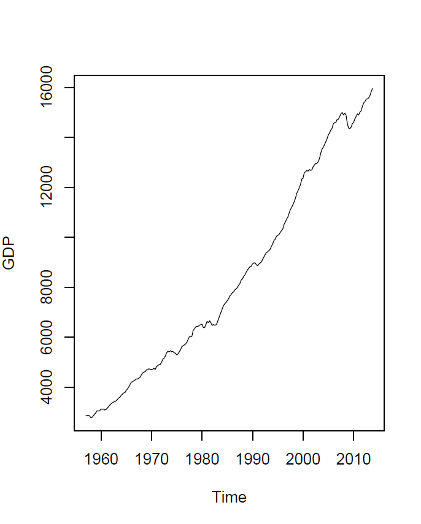
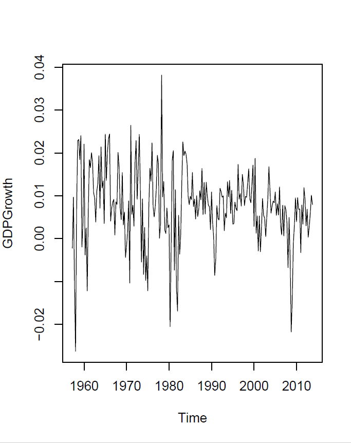

#

<ul>
<li> Una serie de tiempo, corresponde a datos de un individuo u objeto recolectados en múltiples puntos de tiempo.</li>
<li> Este tipo de series puede ser utilizado para responder preguntas que no pueden ser resueltas con el uso de datos de corte transversal visto en Econometría 1.</li>
<li> Por ejemplo, ¿cuál es el efecto causal en una variable de interés, $Y$, del cambio de otra variable, $X$, a través del tiempo?</li>
<li> ¿Cuál es la mejor predicción del valor de una variable en el futuro?</li>
</ul>

#
 

# 
  


#
<ul>
<li> La segunda gráfica muestra el crecimiento del PIB.</li>
<li> Este valor se calcula haciendo una transformación de la serie original del PIB.</li>
<li> Para estimar estos cambios necesitamos definir algunos conceptos básicos.</li>
</ul>

# Rezago Variable

#
<ul>
<li> El primer rezago de una variable $x_t$ se define como $x_{t-1}$</li>
<li> De la misma forma el rezago $j$ de $x_t$ es $x_{t-j}$</li>
<li> Cabe anotar que el rezago depende de la unidad de medida de la variable, e.g. si la variable esta medida anualmente $t-1$ es el año anterior, pero si esta medida mensualmente, $t-1$ es el mes anterior.</li>


# El operador de rezagos
 
#    
Sea $x_t$ una observación aleatoria de una serie de tiempo. Definimos el símbolo $L$ como:

\begin{equation}
    L x_t = x_{t-1}
\end{equation}

$L$ es lo que en matemáticas es conocido como un operador. No es un parámetro o un número pero puede ser tratado como tal para operaciones algebraicas, e.g. $L^2 x_t = L(L x_t) = L x_{t-1} = x_{t-2}$, en general $L^n x_t = x_{t-n}$  

#
    
En adición, la expresión

\begin{equation}
    \alpha(L) = \alpha_0 + \alpha_1 L + \alpha_2 L^2 + \dots + \alpha_p L^p 
\end{equation}

es llamado el polinomio de orden p del operador de rezagos. 

Y si lo aplicamos a un serie de tiempo, generamos una media móvil ponderada de la serie, i.e.

\begin{equation}
    \alpha(L)x_t = \alpha_0 + \alpha_1 x_{t-1} + \alpha_2 x_{t-2} + \dots + \alpha_p x_{t-p} 
\end{equation}


# El operador de diferencia

#

Otro operador usado es

\begin{equation}
    \Delta = 1 - L
\end{equation}

el operador de diferencia. $\Delta x_t = x_t - x_{t-1}$ es el cambio en $x$ en el periodo $t$. 


#

Es importante anotar la diferencia de notación entre <b>el operador de la diferencia de $n$ periodos</b>,

\begin{equation}
    \Delta_n = 1 - L^n
\end{equation}

y, <b>el operador de la diferencia de orden $n$</b>

\begin{equation}
    \Delta^n = (1 - L)^n
\end{equation}

e.g. $\Delta_2 x_t = x_t - x_{t-2}$ y $\Delta^2 x_t= \Delta x_t - \Delta x_{t-1} = (x_t - x_{t-1}) - (x_{t-1} - x_{t-2})$ 


#
<ul>
<li> La primera diferencia del logaritmo de $x_t$ es $\Delta \ln (x_t) = \ln (x_t) - \ln (x_{t-1})$.</li>
<li> El cambio porcentual de una serie de tiempo $x_t$ entre los periodos $t-1$ y $t$ es aproximadamente $100*\Delta \ln (x_t)$. Esta aproximación funciona mejor cuando el cambio porcentual es pequeño.</li>
<li> Es común usar esta aproximación para anualizar crecimientos, por ejemplo con datos trimestrales, se obtiene así,  $4*100*\Delta \ln (x_t)$.</li>


## Cambio porcentual

<ul>
<li> El cambio del logaritmo de una variable es aproximadamente igual al cambio proporcional de dicha variable, i.e. $\ln (X + a) - \ln (X) \cong \frac{a}{X}$.</li> 
<li> Ahora, remplazando $X$ con $x_{t-1}$ y $a$ con $\Delta x_t$. Y, sabiendo que, $x_t =  x_{t-1} + \Delta x_t$.</li>
<li> Esto significa que el cambio proporcional entre los periodos $t$ y $t-1$ es aproximadamente, 
    \begin{align}
       \Delta  \ln (x_t) = \ln (x_t) - \ln (x_{t-1}) & =  \ln (x_{t-1} + \Delta x_t) - \ln (x_{t-1}) \\
       & \cong \frac{\Delta x_t}{x_{t-1}}
    \end{align}</li>
</ul>    


# Estacionariedad

#

<ul>
<li> Las series de tiempo usan los datos pasados para cuantificar relaciones históricas.</li>
<li> Si el futuro es parecido al pasado, entonces estas relaciones históricas se pueden usar para hacer predicciones.</li>
<li> Si este no es el caso, entonces estas relaciones históricas no son fiables para hacer predicciones.</li>
<li> Esta idea es formalmente conocida como <b> estacionariedad</b>.
</ul>


#

<b>Estacionariedad débil:</b>
Una secuencia aleatoria $\{x_t\}$ es estacionaria débil (o estacionaria en covarianza) si la media, varianza y la secuencia de autocovarianzas de orden $j$ , para $j>0$ son independientes de $t$ 


#

<b>Estacionariedad Estricta:</b>

Es aquel que su distribución de probabilidad conjunta se mantiene constante durante el tiempo

Si se toma cualquier colección de variables aleatorias de la secuencia y se desplaza n periodos, la distribución de probabilidad conjunta debe permanecer inalterada

#

Estacionariedad estricta implica estacionariedad débil, pero lo contrario no siempre aplica.

En el caso especial de la distribución normal, estacionariedad débil si implica estacionariedad estricta. 
    

# Procesos No-estacionarios

<ul>
<li> La no-estacionariedad de una serie genera problemas de estimación de los parámetros. Ahora discutiremos tres de ellos:</li>
<ul>
<li> El parámetro del proceso AR(1) es sesgado hacia cero.</li>
<li> El parámetro puede tener una distribución no-normal.</li>
<li>Obtenemos regresiones espurias.</li>

# Ejemplos 

# Procesos con Tendencia Determinística

#

consideremos el siguiente proceso con tendencia y $|\phi| < 1$,

\begin{equation}
    x_t = \delta + \alpha t + \phi x_{t-1} + \varepsilon_t 
\end{equation}

Si estimamos la media de este proceso vemos que depende del tiempo,

\begin{align*}
    E[x_t] & = E[\delta + \alpha t + \phi x_{t-1} + \varepsilon_t] 
\end{align*}


#

reemplazando obtenemos,

\begin{align*}
    E[x_t] & = E[\delta] + E[\alpha t] + E[\phi x_{t-1}] + E[\varepsilon_t] \\
           & = \delta + \alpha t + \phi E[\delta + \alpha (t-1) + \phi x_{t-2} + \varepsilon_{t-1}] \\
           & \vdots \\
           & = \sum_{i=0}^{n-1} \phi^i (\delta + \alpha (t-i))  
\end{align*}

dado que $|\phi| < 1$ y $n \rightarrow \infty$


#

por lo tanto la media sería,

\begin{equation}
    E[x_t]  = \frac{\delta (1-\phi) + \alpha \phi (t + 1)}{(1-\phi)^2}
\end{equation}

y dado que depende de $t$ no sería estacionaria bajo nuestra definición de estacionariedad. 
    

#

<ul>
<li> Sin embargo, noten que $t$ cumple con la condición de ser un proceso determinístico, ya que sabemos perfectamente el valor que va a tomar con antelación.</li>
<li> Por lo tanto, podemos pensar en una transformación donde excluimos la tendencia determinística de la serie permitiendo que la serie ya no dependa de $t$.</li>
<li> A este tipo de procesos se les conoce como procesos estacionarios en tendencia, y es común su uso para filtros en economía.</li>
</ul>

# Paseo aleatorio

#

Ahora veamos el caso del proceso definido como,

\begin{equation}\label{eq:rw}
    x_t = x_{t-1} + \varepsilon_t
\end{equation}

Este proceso es conocido como "random walk" o paseo aleatorio.


#

¿Es este proceso estacionario (débil)? Para esto miremos cual es la media y la varianza de este modelo.

\begin{align}
    E(x_t) & = E( x_{t-1} + \varepsilon_t)  \\
    & =    E(x_{t-1}) + E(\varepsilon_t)  \\
    & =   E[ ( x_{t-2} + \varepsilon_{t-1})] +  E(\varepsilon_t)  \\
 & =    E[ x_{t-2}] +   E[ \varepsilon_{t-1}] +  E(\varepsilon_t) \\
                 & =    E[(x_{t-3} + \varepsilon_{t-2})]  +   E[ \varepsilon_{t-1}] +  E(\varepsilon_t)
\end{align}

## Propiedades de la esperanza

\begin{align}
        E(X + Y) & = E(X) + E(Y) \\
        E(k* X) & = k E(X) \text{ Para todo } k \in \mathbb{R} \\
        E(X*Y) & = E(X) * E(Y) \text{ Sí y solo sí X y Y son independientes} \\
        E(X) & = E[E(X | Y)]
    \end{align}

#

Si seguimos iterando hacia atrás obtenemos 
\begin{align}
    E(x_t) & = E[x_{t-n}] + E[\varepsilon_{t-(n-1)}]  + \dots + E[ \varepsilon_{t-1}] +  E(\varepsilon_t) \\
    \\
    E(x_t) & =  E[x_{t-n}] + 0 + \dots + 0 + 0 \\
    E(x_t) & =  E[x_{t-n}]
\end{align}    

# 

Ahora hacemos lo mismo para la varianza, por facilidad de exposición asumimos que $E[x_1] = 0$:    

\begin{align}
Var(x_t) & = E[(x_t - E[x_t])^2] \\
         & = E[x_t^2] \\
  & = E[(x_{t-1} + \varepsilon_t)^2]  \\
 & = E[(x_{t-1})^2] + 2E[ x_{t-1}\varepsilon_t] + E[\varepsilon_t^2] \\
         & =  E[x_{t-1}^2] + 0 + E[\varepsilon_t^2] \end{align}    

#

Si seguimos iterando hacia atrás obtenemos


\begin{align}
Var(x_t) & =  E[( x_{t-2} + \varepsilon_{t-1})^2] + E[\varepsilon_t^2] \\
         & =  E[x_{t-2}^2] +  E[\varepsilon_{t-1}^2] + E[\varepsilon_t^2] \\
\end{align}

Repitiendo este proceso, obtenemos

\begin{align}
Var(x_t) & =  E[x_{t-n}^2] +  E[\varepsilon_{t-n}^2 ] + \dots  + E[\varepsilon_{t-1}^2] + E[\varepsilon_t^2] \\
\end{align}    


#

Suponiendo $Var(x_1) = \sigma^2$, este proceso tiene varianza igual a,

\begin{equation}
    \gamma_{0,t} = t \sigma^2
\end{equation}

por lo cual el proceso es no estacionario. 

Se deja como ejercicio, que la auto-covarianza es,

\begin{equation}
    \gamma_{j,t} = (t-j) \sigma^2 
\end{equation}

#

Finalmente, la auto-correlación esta dada por,

\begin{align*}
    \rho_{j,t} & = \frac{\gamma_{j,t}}{\sqrt{\gamma_{0,t}}\sqrt{\gamma_{0,t-j}}} \\
        & = \frac{(t-j)\sigma^2}{\sqrt{t \sigma^2} \sqrt{(t -j)\sigma^2} }  \\
       & = \frac{\sqrt{t-j}}{\sqrt{t}}
\end{align*}

#

Sin embargo, podemos hacer uso del operador de diferencias para convertir esta serie en un proceso estacionario,

\begin{equation}
    w_t = \Delta x_t = x_t - x_{t-1} = \varepsilon_t
\end{equation}

donde $w_t$ es estacionario. 

#

Acá pasamos de $x_t$ a $w_t$ pero siempre podemos hacer el proceso contrario en caso tal que deseemos conocer los valores de la serie original

\begin{align}
    x_t & = w_t + x_{t-1} \\
        & = w_t + w_{t-1} + x_{t-2} \\
        & \vdots \\
        & = w_t + w_{t-1} + w_{t-2} + w_{t-3} + \dots 
\end{align}

por lo tanto el proceso $x_t$ se obtiene sumando o integrando el proceso $w_t$

#

Por esta razón, el paseo aleatorio hace parte de la clase de modelos integrados.

Los modelos integrados son aquellos que se pueden obtener mediante suma o integración de modelos estacionarios


# Pruebas de Raíces unitarias

#

Por este motivo se han diseñado diferentes pruebas estadísticas para asegurase de la estacionariedad de la serie. A continuación veremos cuatro de las pruebas más usadas:

<ul>
<li> Prueba de Dickey-Fuller. </li>
<li> Prueba de Dickey-Fuller aumentada. </li>
<li> Prueba de Phillips-Perron. </li>
<li> Prueba KPSS. </li>
</ul>

# Prueba de Dickey-Fuller

#

Dickey y Fuller (1979) consideraron el modelo AR(1),

\begin{equation}
    x_t = \phi x_{t-1} + \varepsilon_t 
\end{equation}

Cuando $\phi =1$ este proceso tiene raíz unitaria y se vuelve un paseo aleatorio.

Si substraemos $x_{t-1}$ de ambos lados, obtenemos

\begin{equation}\label{df}\tag{*}
    \Delta x_t = (\phi - 1) x_{t-1} + \varepsilon_t
\end{equation}

Así, para testear la hipótesis de raíz unitaria, podemos testear que el coeficiente de $x_{t-1}$ en la ecuación (*) sea igual a cero, contra la alternativa que es menor a cero
    
#

<ul>
<li> La regresión (*) es conocida como una regresión des-balanceada ya que la variable dependiente es I(0). i.e. estacionaria, y la variable independientes es I(1), i.e. integrada de orden 1, bajo la hipótesis nula.</li>
<li> Bajo la hipótesis alternativa, ambas variables son estacionarias volviendo la regresión balanceada de nuevo.</li>
</ul>

#

<ul>
<li> La forma obvia de testear la hipótesis de raíz unitaria en la ecuación (*) es usando el estadístico t para probar su significancia.</li>
<li> Sin embargo, el parámetro $\phi - 1$ de esta ecuación no sigue una distribución normal, por lo cual los p-values derivados de este supuesto estarían erróneos.</li>
<li> MacKinnon (1996) derivó las probabilidades asociadas a las distribuciones de este parámetro a través de simulaciones. Estos valores son los que reportan la mayoría de paquetes estadísticos.</li>
</ul>

#

Además de la ecuación (*), D-F también desarrollaron el método para casos con constante, i.e.

\begin{equation}\label{df2}\tag{+}
    \Delta x_t = \delta + (\phi - 1) x_{t-1} + \varepsilon_t
\end{equation}

y tendencia 

\begin{equation}\label{df3}\tag{^}
    \Delta x_t = \delta + \alpha t +  (\phi - 1) x_{t-1} + \varepsilon_t
\end{equation}

MacKinnon (1996) también estimo las probabilidades asociadas a los parámetros de (+) y (^). En economía por lo general testeamos usando (+)


# Prueba de Dickey-Fuller Aumentado

#

Los resultados anteriores parten de un modelo AR(1), Dickey (1984) extendió estos resultados para proceso AR(p), de forma tal que lo podemos escribir como,

\begin{align}\label{dfa}
   \Delta  x_t & = \beta  x_{t-1} + \phi_1'\Delta x_{t-1} +  \phi_2' \Delta x_{t-2} \\
   & + \dots + \phi_{p-1}' \Delta x_{t-(p-1)} +  \varepsilon_t \tag{++}
\end{align}
donde $\beta$ sigue la misma distribución que el parámetro de (*). También se puede extender para las ecuaciones (+) y (^)

# Prueba de Phillips-Perron

#
<ul>
<li> Phillips y Perron (1988) desarrollaron un test basado en la ecuación (*), en el cual no se estima la correlación serial como en (++), pero utilizan un estimador no-parametrico consistente para heteroscedastidad y auto-correlación, a la Newey-West.  
<li> Este estimador sigue la misma distribución que D-F por lo cual los valores de MacKinnon (1996) pueden ser utilizados.</li>
<li> Sin embargo, Schwert (1989), y Perron y Ng (1996) mostraron que este estimador funciona peor que el D-F aumentado en muestras finitas, por lo cual D-F aumentado tiende a ser preferido.</li>
</ul>

# Prueba KPSS

#
<ul>
<li> D-F y PP tienen como hipótesis nula la existencia de raíz unitaria. Estos test tienen el problema que carecen de poder para rechazar, por lo cual tienden a encontrar raíces unitarias cuando estas no existen.</li>
<li> Kwiatkowski, Phillips, Schimdt and Shin (1992) crearon un test donde la hipótesis nula es I(0), i.e. la serie es estacionaria.</li>
</ul>

#
Este test es basado en que si la serie es estacionaria y la diferenciamos una vez se vuelve de orden I(-1).
 
El estadístico considerado es entonces:
    \begin{equation}
        \hat{\eta}_{\mu} = \frac{1}{n^2 s_{nl}^2} \sum_{t=1}^n S_{t}^2
    \end{equation}
    
donde, $s_{nl}^2$ es un estimador consistente de $\sigma^2$ y $S_t = \sum_{s=1}^t (x_s - \bar{x})$

# Código R
        
##

```{r AR function, echo=FALSE, warning=FALSE}
library(geometry) # Dot product.
#AR(p) with standard error series with the parametrization and traditional transformed
#' series.
#' 
#' @param p Order of the AR. Must be a integer number.
#' @param n Sample size of the series.
#' @param phi Real coefficients of the AR. Predefined, are random numbers
#' between -1 and 1. Must be of length p.
#' @param x0 p initial values of the series. Predefined, are random numbers
#' between -1 and 1. Must be of length p.
#' @param alpha Tendency real parameter. Real number.
#' @return List that has the original AR(\code{p}) series with parametrization
#' \code{phi} and \code{alpha}, as well as an associated series. This series are:
#' x.tend (tendency stationary), x.int (differentiation stationary) and x.int.tend
#' (tendency and differentiation stationary)
#' @example 
#' # AR(1) with 1000 sample sizes.
#' p <- 1; n <- 1000
#' phi <- c(0.2, 0.4); alpha <- 0.03
#' x0 <- c(0.3, 0.5)
#' ar <- AR(p, n, phi, x0, alpha)
#' plot(ar$x)
#' plot(ar$x.int)
#' @example 
#' # AR(4) with 1000 sample sizes and default parameters.
#' ar <- AR(4, 1000)
#' plot(ar$x)
#' plot(ar$x.tend)
AR <- function(p, n, 
               phi = runif(p, min = -1, max = 1),
               x0 = runif(p, min = -1, max = 1),
               alpha = 0.01, delta = 0){
  # Initiallize series.
  x <- c(x0, rep(NA, n-p))
  
  # AR simulation for each observation.
  for (i in (p+1):n){
    I <- (i-p):(i-1)
    if (p==1){
      x[i] <- delta + x[I]*phi + rnorm(1)
    } else if (p > 1){
      x[i] <- delta + dot(x[I], phi) + rnorm(1)
    } else {
      warning("p must be a positive integer.")
    }
  }
  # Organize results.
  results <- list(x = x,
                  phi = phi,
                  alpha = alpha,
                  x.int = diffinv(x),
                  x.tend = alpha*1:n + x,
                  x.int.tend = alpha*1:(n+1) + diffinv(x)
                  )
  return(results)
}
    
ar <- AR(p = 2, n = 1000, x0 = c(14, 14.1), phi = c(0.2, -0.6), alpha = 0.02, delta = 20)
data <- ar$x.tend
```

La serie **data** es un AR(2) con intercepto y tendencia, es decir, no es estacionaria. Suponiendo que desconocemos esta información, para verificar esto, podemos las librerias de R _urca_ y _tseries_. Ambas tienen implementadas todas las pruebas de raices unitarias vistas en clase, solo cambian en como muestran los resultados y en algunas opciones adicionales para algunas pruebas. Por conveniencia en este ejemplo usaremos la _tseries_.

##

De manera visual se observa que la serie es no estacionaria, aunque parece serlo en tendencia y con intercepto. Comprobamos este hecho con las diferentes pruebas. Cabe resaltar que para la libreria _tseries_, ADF (Dickey-Fuller aumentada) y PP (Phillips-Perron) son pruebas que soportan una serie con tendencia e intercepto. Por su parte, KPSS por default solo incluye el intercepto. Así, que se quiere probar si la serie es estacionaria sólo con intercepto o sin tendencia ni intercepto, debemos recurrir a la libreria _urca_.

##

```{r lib, include=FALSE}
library(tseries)
```

```{r plot, echo=FALSE, warning=FALSE}

plot(data, type = 'l')
```
        
##

ADF rechaza la hipótesis nula así que concluimos que la serie estacionaria.

```{r adf, echo=TRUE, warning=FALSE}
library(tseries)
adf.test(data)
```
        
##

De igual manera, PP rechaza la hipótesis nula así que concluimos que la serie estacionaria.

```{r pp, echo=TRUE, warning=FALSE}
pp.test(data)
```
        
##

Finalmente, KPSS de manera predeterminada rechaza que la serie sea estacionaria pues no considera estacionareidad en tendencia, pero al cambiar el parámetro _null_ por _"Trend" si la incluye y por tanto no encuentra evidencia de que la serie sea no estacionaria. En conclusión, tenemos evidencia para afirmar que la serie es estacionaria con intercepto y en tendencia.

```{r kpss, echo=TRUE, warning=FALSE}
kpss.test(data)
kpss.test(data, null = "Trend")
```
