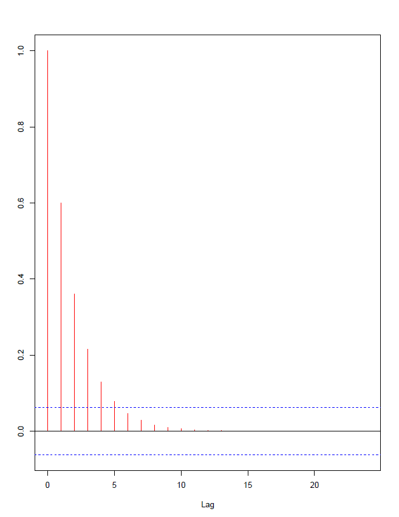
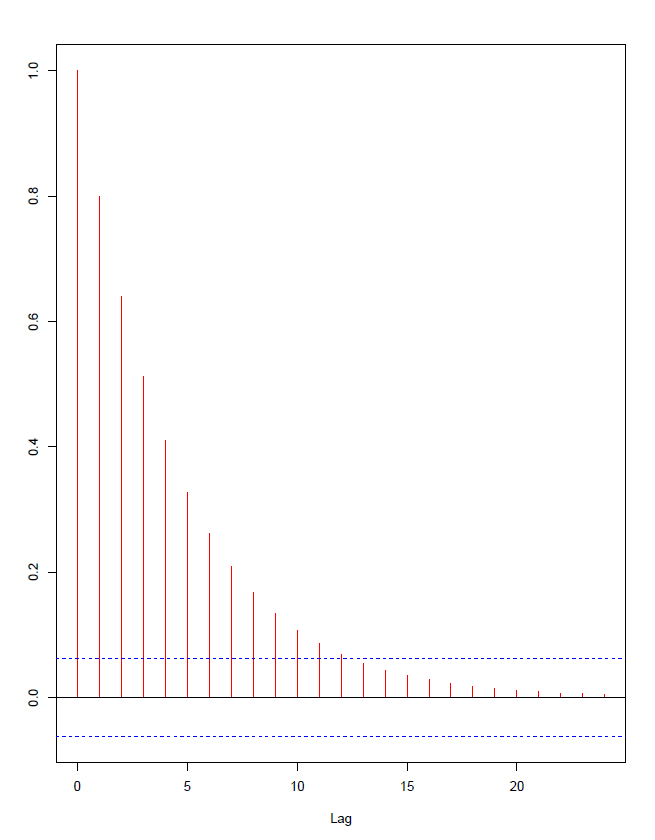
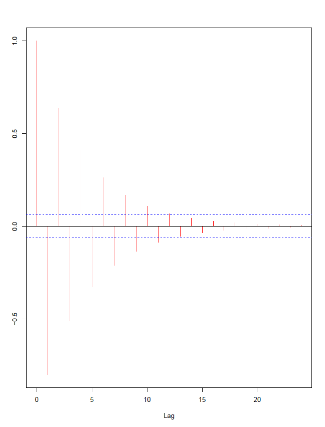
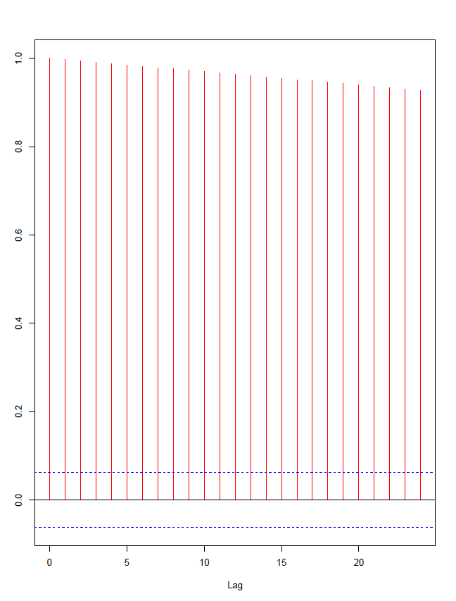

# Modelo AR(1)

#

Ahora si podemos definir formalmente nuestro primer modelo lineal, el modelo Autoregresivo de orden 1 o AR(1)

\begin{equation}
    (1-\phi  L)x_t = \varepsilon_t
\end{equation}

Que también podemos escribir como $x_t = \phi x_{t-1} + \varepsilon_t$. El AR(1) puro depende entonces solo de la variable de interés rezagada y el proceso de innovación. 

#

Como vimos cuando miramos el paseo aleatorio, necesitamos que $|\phi|<1$, bajo este supuesto miremos las condiciones de estacionariedad. 

\begin{align}
    E(x_t) & = E(\phi x_{t-1} + \varepsilon_t) \\
  & =   \phi E(x_{t-1}) + E(\varepsilon_t)  \\
 & =  \phi E[ (\phi x_{t-2} + \varepsilon_{t-1})] +  E(\varepsilon_t)  \\
    & =   \phi^2 E[ x_{t-2}] +  \phi E[ \varepsilon_{t-1}] +  E(\varepsilon_t) \\
                 & =   \phi^2 E[(\phi x_{t-3} + \varepsilon_{t-2})]  +  \phi E[ \varepsilon_{t-1}] +  E(\varepsilon_t)
\end{align}

Es importante recalcar que, a cada componente de la ecuación de $x_t$ se remplaza por rezago, lo cual se conoce como iterar hacia atras.
#

Si seguimos iterando hacia atrás obtenemos 
\begin{align}
    E(x_t) & = \phi^n E[x_{t-n}] + \phi^{n-1} E[\varepsilon_{t-(n-1)}]  + \dots + \phi E[ \varepsilon_{t-1}] +  E(\varepsilon_t) \\
    \\
    E(x_t) & = \phi^n E[x_{t-n}] + 0 + \dots + 0 + 0 \\
    E(x_t) & = \phi^n E[x_{t-n}]
\end{align}    

Suponemos que $n \rightarrow \infty$ por lo tanto $E(x_t) =0$  

#

Ahora hacemos lo mismo para la varianza, y bajo $E[x_t] = 0$:    

\begin{align}
Var(x_t) & = E[(x_t - E[x_t])^2] \\
         & = E[x_t^2] \\
  & = E[(\phi x_{t-1} + \varepsilon_t)^2]  \\
  & = E[(\phi x_{t-1})^2] + 2E[\phi x_{t-1}\varepsilon_t] + E[\varepsilon_t^2] \\
         & = \phi^2 E[x_{t-1}^2] + 0 + E[\varepsilon_t^2] 
\end{align}    

#

Si seguimos iterando hacia atrás obtenemos

\begin{align}
Var(x_t) & = \phi^2 E[(\phi x_{t-2} + \varepsilon_{t-1})^2] + E[\varepsilon_t^2] \\
         & = \phi^4 E[x_{t-2}^2] + \phi^2 E[\varepsilon_{t-1}^2] + E[\varepsilon_t^2] \\
\end{align}

Repitiendo este proceso, obtenemos

\begin{align}
Var(x_t) & = \phi^{2n} E[x_{t-n}^2] + \phi^{2(n-1)} E[\varepsilon_{t-(n-1)}^2 ] + \dots  + \\
& \phi^2 E[\varepsilon_{t-1}^2] + E[\varepsilon_t^2] \\
\end{align}    

#

Bajo $|\phi| < 1$, 

\begin{align}
Var(x_t) & = \phi^{2(n-1)} E[\varepsilon_{t-n}^2 ] + \dots  + \phi^2 E[\varepsilon_{t-1}^2] + E[\varepsilon_t^2]
\end{align}

Que podemos escribir como $Var(x_t) = E[\phi(L)\varepsilon_t]$. Ahora, si multiplicamos por $\phi^2$ obtenemos

\begin{align}
\phi^2E[\phi(L)\varepsilon_t] & =  \phi^{2n} E[\varepsilon_{t-n}^2 ] + \dots  + \phi^4 E[\varepsilon_{t-1}^2] + \phi^2 E[\varepsilon_t^2]   
\end{align}

#

Reemplazamos por el valor de la esperanza,

\begin{align}
E[\phi(L)\varepsilon_t] & =  \phi^{2(n-1)} \sigma^2 + \dots  + \phi^2 \sigma^2 + \sigma^2 \\
\phi^2E[\phi(L)\varepsilon_t] & = \phi^{2n} \sigma^2 + \dots  + \phi^4 \sigma^2 + \phi^2 \sigma^2 
\end{align}

Y restamos

\begin{align}
E[\phi(L)\varepsilon_t] - \phi^2E[\phi(L)\varepsilon_t] & = \phi^{2(n-1)} \sigma^2 + \dots  + \phi^2 \sigma^2 + \sigma^2  \\
& -  \phi^{2n} \sigma^2 -  \dots  - \phi^4 \sigma^2 - \phi^2 \sigma^2 \\
(1 - \phi^2) E[\phi(L)\varepsilon_t] & =  \sigma^2 -  \phi^{2n} \sigma^2 
\end{align}

#

dado que $|\phi | < 1$, finalmente obtenemos 

\begin{align}
    E[\phi(L)\varepsilon_t] & = \frac{\sigma^2}{1 - \phi^2} \\
    Var(x_t) & = \frac{\sigma^2}{1 - \phi^2}
\end{align}

#

Finalmente, miremos la auto-covarianza para un proceso estacionario:

\begin{align}
    \gamma_j & = cov(x_t,x_{t-j}) \\
             & = E[(x_t x_{t-j}) - \mu_t\mu_{t-j}] \\
             & = E[x_t x_{t-j}]
\end{align}

Dado que $\mu_t=0$

#

Reemplazamos $x_t$ y obtenemos:

\begin{align}
    \gamma_j & = E[ (\phi x_{t-1} + \varepsilon_t ) x_{t-j}] \\
             & = E[ \phi x_{t-1} x_{t-j} + \varepsilon_t x_{t-j}] \\
            & = \phi E[x_{t-1} x_{t-j}] + E[\varepsilon_t x_{t-j}] \\
            & = \phi E[x_{t-1} x_{t-j}]  
\end{align}

Donde $E[\varepsilon_t x_{t-j}]=0$ cuando $j \geq 1$   

#

Como vimos previamente $\gamma_j = E[x_t x_{t-j}]$, por lo tanto     

\begin{equation}
    \gamma_j = \phi \gamma_{j-1}
\end{equation}

resolvemos entonces para $\gamma_0$, $\gamma_1$ y generalizamos para $\gamma_j$. Es fácil ver que $\gamma_0$ es $Var(x_t)$

#

Por lo tanto:

\begin{align}
    \gamma_0 & = \frac{\sigma^2}{1 - \phi^2} \\
    \gamma_1 & = \phi \frac{\sigma^2}{1 - \phi^2} \\
    \gamma_2 & = \phi^2 \frac{\sigma^2}{1 - \phi^2} \\
             & \vdots \\
    \gamma_j & = \phi^j \frac{\sigma^2}{1 - \phi^2}   \end{align}

## Estacionariedad auto-covarianza

##

Un punto de aclaración cuando hablamos de estacionariedad lo definimos como no dependiente de $t$. Debido a que la auto-covarianza depende de $j$ muchas veces hay confusión sobre la estacionariedad de este proceso. Sin embargo, este proceso si es estacionario, la razón es que solo importa la distancia entre las observaciones, no cuanto tiempo haya pasado desde el inicio del proceso. E.g,

\begin{equation}
    E[x_t x_{t-j}]  = E[x_{t-n} x_{t-j-n}] = \gamma_j 
\end{equation}

#

Estimamos entonces la auto-correlación

\begin{align}
    \rho_0 & = \frac{\gamma_0}{\gamma_0}  = 1 \\
    \rho_1 & =  \frac{\phi \gamma_0}{\gamma_0}  = \phi \\
    \rho_2 & =  \frac{\phi \gamma_1}{\gamma_0}  = \phi^2 \\
             & \vdots  \\
    \rho_j & =  \frac{\phi \gamma_{j-1}}{\gamma_0}  = \phi^j  
\end{align}

#

Con la auto-correlación podemos hacer el auto-correlograma el cual grafica la auto-correlación en cada rezago. Observemos diferentes modelos AR(1) y las diferencia de sus auto-correlogramas teóricos.

#

$x_t = 0.6 x_{t-1} + \varepsilon_t$
  

#

$x_t = 0.8 x_{t-1} + \varepsilon_t$
  

#

$x_t = -0.8 x_{t-1} + \varepsilon_t$
 

#
$x_t = x_{t-1} + \varepsilon_t$

 

# Modelo AR(p)

#

Definimos el modelo AR(p) como
     
\begin{equation}
  x_t = \phi_1 x_{t-1} + \phi_2 x_{t-2} + \dots + \phi_p x_{t-p} + \varepsilon_t
\end{equation}
    
o usando el operador de rezagos
    
\begin{equation}
       \phi(L)x_t = \varepsilon_t
    \end{equation}

#

El proceso es estacionario si las soluciones de $\lambda_i$ de la ecuación

\begin{equation}
    \lambda^p - \phi_1 \lambda^{p-1} - \dots - \phi_p = 0  
\end{equation}

caen dentro del circulo de unidad

#

Asumiendo estacionariedad y realizando el mismo proceso que vimos para el proceso AR(1) podemos obtener la media del proceso como:

\begin{equation}
\mu = \frac{E[\varepsilon_t]}{1- \phi_1 - \phi_2 - \dots - \phi_p}    
\end{equation}

Así en el caso sin constante $\mu = 0$

#

Ahora para estimar las auto-covarianzas,

\begin{align}
E[x_t x_{t-j}] & =  E[(\phi_1 x_{t-1} + \phi_2 x_{t-2} + \dots + \phi_p x_{t-p} +  \varepsilon_t) x_{t-j}] \\
E[x_t x_{t-j}] & = \phi_1 E[x_{t-1}x_{t-j}] + \phi_2 E[x_{t-2}x_{t-j}] + \dots + \phi_p E[x_{t-p} x_{t-j}] \\
& + E[\varepsilon_t x_{t-j}] \\
 \gamma_j & = \phi_1 \gamma_{j-1} + \phi_2 \gamma_{j-2} + \dots + \phi_p \gamma_{j-p} + E[\varepsilon_t x_{t-j}]
\end{align}

#

Teniendo en cuenta que $\gamma_{-j} = \gamma_{j}$, podemos estimar la varianza, como $\gamma_0$

\begin{equation}
    \gamma_0  = \phi_1 \gamma_{1} + \phi_2 \gamma_{2} + \dots + \phi_p \gamma_{p} + \sigma^2
\end{equation}

Y para valores de $j>0$

\begin{equation}
    \gamma_j = \phi_1 \gamma_{j-1} + \phi_2 \gamma_{j-2} + \dots + \phi_p \gamma_{j-p} 
\end{equation}

#

Y para las auto-correlaciones dividimos por $\gamma_0$ y obtenemos

\begin{equation}
   \rho_j = \phi_1 \rho_{j-1} + \phi_2 \rho_{j-2} + \dots + \phi_p \rho_{j-p}  
\end{equation}

##

con esto podemos estimar las ecuaciones de Yule-Walker, 
 
 \begin{align}
    \rho_1  & = \phi_1  + \phi_2 \rho_1 + \dots + \phi_p \rho_{p-1}  \\
    \rho_2  & = \phi_1 \rho_1 + \phi_2  + \dots + \phi_p \rho_{p-2} \\
            &  \vdots \\
    \rho_p  & = \phi_1 \rho_{p-1} + \phi_2 \rho_{p-2} + \dots + \phi_p 
\end{align}

##

Y en forma matricial para los términos de $\phi$,

\begin{equation}
\begin{bmatrix}
 \phi_1 \\ 
\phi_2 \\
\vdots \\
\phi_p
\end{bmatrix}    
=
\begin{bmatrix}
 1 & \rho_1 & \dots & \rho_{p-1} \\ 
\rho_1 & 1 & \dots & \rho_{p-2} \\
\vdots & \vdots & \ddots & \vdots \\
\rho_{p-1} & \rho_{p-2} & \dots & 1 
\end{bmatrix}^{-1}  
\begin{bmatrix}
 \rho_1 \\ 
\rho_2 \\
\vdots \\
\rho_p
\end{bmatrix} 
\end{equation}

# Modelos de Medias Móviles

# MA(1)

#

Ahora miramos  los modelos de medias móviles, empezamos por el modelo de medias móviles de orden 1, o MA(1).

Un modelo MA(1) se define como,

\begin{equation}
    x_t = \varepsilon_t - \theta \varepsilon_{t-1}
\end{equation}

usando el operador de rezagos $x_t = (1-\theta L) \varepsilon_{t}$

#

Ahora calculamos la esperanza de este proceso,

\begin{align}
    E[x_t] & = E[\varepsilon_t - \theta \varepsilon_{t-1}] \\
    E[x_t] & = E[\varepsilon_t] - \theta E[\varepsilon_{t-1}] \\
    E[x_t] & = 0
\end{align}

#

Y la varianza

\begin{align}
    \gamma_0 & = E[x_t x_t] \\
             &  = E[(\varepsilon_t - \theta \varepsilon_{t-1})^2] \\
   & = E[\varepsilon_t^2] - 2\theta E[\varepsilon_t \varepsilon_{t-1}] + \theta^2 E[\varepsilon_{t-1}^2] \\
 & = \sigma^2 + \theta^2 \sigma^2 \\
                & = \sigma^2 (1+\theta^2)
\end{align}
    
#

Ahora, estimamos la auto-covarianza $\gamma_j$ del proceso,

\begin{align}
    \gamma_j & = E[x_t x_{t-j}] \\
             & = E[(\varepsilon_t - \theta \varepsilon_{t-1})(\varepsilon_{t-j} - \theta \varepsilon_{t-j-1})] \\
 & = E[\varepsilon_t \varepsilon_{t-j}] - \theta E[ \varepsilon_{t-1} \varepsilon_{t-j}] - \theta E[ \varepsilon_{t} \varepsilon_{t-j-1}] + \theta^2 E[ \varepsilon_{t-1} \varepsilon_{t-j-1}]
\end{align}    
    
#

Si  $j = 1$ obtenemos,

\begin{align}
    \gamma_1     & = E[\varepsilon_t \varepsilon_{t-1}] - \theta E[ \varepsilon_{t-1} \varepsilon_{t-1}] - \theta E[ \varepsilon_{t} \varepsilon_{t-2}] + \theta^2 E[ \varepsilon_{t-1} \varepsilon_{t-2}] \\
             & =  0  - \theta \sigma^2 - 0 + 0 \\
                & =   - \theta \sigma^2      
\end{align}  

#

si $j=2$,
\begin{align}
    \gamma_2     & = E[\varepsilon_t \varepsilon_{t-2}] - \theta E[ \varepsilon_{t-1} \varepsilon_{t-2}]  - \theta E[ \varepsilon_{t} \varepsilon_{t-3}] + \theta^2 E[ \varepsilon_{t-1} \varepsilon_{t-3}] \\
                 & = 0
\end{align} 

#

En general, para todo $j>1$, obtenemos

\begin{align}
    \gamma_j     & =  E[\varepsilon_t \varepsilon_{t-j}] - \theta E[ \varepsilon_{t-1} \varepsilon_{t-j}] - \theta E[ \varepsilon_{t} \varepsilon_{t-j-1}] + \theta^2 E[ \varepsilon_{t-1} \varepsilon_{t-j-1}] \\
                 & = 0
\end{align} 

Noten que para cualquier valor de $\theta$, el proceso es estacionario débil, ya que no se deben imponer restricciones sobre el parámetro para obtener la media, varianza o auto-covarianzas
    
#

Finalmente, estimamos las auto-correlaciones $\rho_i$,

\begin{align}
    \rho_1 & = \frac{\gamma_1}{\gamma_0} \\
           & = \frac{- \theta \sigma^2}{\sigma^2 (1+\theta^2)} \\
     & = \frac{- \theta }{ (1+\theta^2)} 
\end{align}

y dado que $\gamma_j=0$ para todo $j>1$, esto implica que $\rho_j=0$ para todo $j>1$
    

# MA(q)

#

Ahora generalizamos para el caso con $q$ rezagos. Definimos el proceso MA(q) como,

\begin{equation}
    x_t = \varepsilon_t - \theta_1 \varepsilon_{t-1} - \theta_2  \varepsilon_{t-2} - \dots - \theta_q \varepsilon_{t-q}
\end{equation}

usando el operador de rezagos $x_t = (1-\theta_1 L - \theta_2 L^2 - \dots - \theta_q L^q) \varepsilon_{t}$

#

Calculamos la esperanza de este proceso,

\begin{align}
    E[x_t] & = E[\varepsilon_t - \theta_1 \varepsilon_{t-1} - \theta_2 \varepsilon_{t-2} - \dots - \theta_q \varepsilon_{t-q}] \\
    E[x_t] & = E[\varepsilon_t] - \theta_1 E[\varepsilon_{t-1}] - \theta_2 E[\varepsilon_{t-2}] - \dots - \theta_q E[\varepsilon_{t-q}] \\
    E[x_t] & = 0
\end{align}

#

Y la varianza

\begin{align}
    \gamma_0 & = E[x_t x_t] \\
             &  = E[(\varepsilon_t - \theta_1 \varepsilon_{t-1} - \theta_2 \varepsilon_{t-2} \dots - \theta_q \varepsilon_{t-q})^2] \\
    & = \sigma^2 + \theta_1^2 \sigma^2 + \theta_2^2 \sigma^2 + \dots + \theta_q^2 \sigma^2 \\
  & = \sigma^2 (1+\theta_1^2 + \theta_2^2 + \dots + \theta_q^2) 
\end{align}

#

Ahora, estimamos la auto-covarianza $\gamma_j$ del proceso,

\begin{align}
    \gamma_j & = E[x_t x_{t-j}] \\
             & = E[(\varepsilon_t - \theta_1 \varepsilon_{t-1} - \theta_2 \varepsilon_{t-2} - \dots - \theta_q \varepsilon_{t-q}) \\
            & (\varepsilon_{t-j} - \theta_1 \varepsilon_{t-j-1} - \theta_2 \varepsilon_{t-j-2} - \dots - \theta_q \varepsilon_{t-j-q})] \\
\end{align}    

#

Veamos para el caso de $\gamma_1$,

\begin{align}
     \gamma_1  & = E[(\varepsilon_t - \theta_1 \varepsilon_{t-1} - \theta_2 \varepsilon_{t-2} - \dots - \theta_q \varepsilon_{t-q}) \\
            & (\varepsilon_{t-1} - \theta_1 \varepsilon_{t-2}  - \theta_2 \varepsilon_{t-3} - \dots - \theta_q \varepsilon_{t-q-1})] \\
\end{align}

#

Sabemos que la esperanza de los términos $\varepsilon$ que no estén en el mismo periodo es 0. Entonces, en este caso obtendríamos,

\begin{align}
     \gamma_1  & = - \theta_1 \sigma^2 +  \theta_1\theta_2 \sigma^2 + \dots +   \theta_{q-1}\theta_q \sigma^2 \\
\end{align}
    
#

Ahora para $\gamma_2$,

\begin{align}
     \gamma_2  & = E[(\varepsilon_t - \theta_1 \varepsilon_{t-1} - \theta_2 \varepsilon_{t-2} - \dots - \theta_q \varepsilon_{t-q}) \\
            & (\varepsilon_{t-2} - \theta_1 \varepsilon_{t-3}  - \theta_2 \varepsilon_{t-4} - \dots - \theta_q \varepsilon_{t-q-2})] \\
\end{align}
    
#

Entonces, en este caso obtendríamos,

\begin{align}
     \gamma_2  & = - \theta_2 \sigma^2 +  \theta_1\theta_3 \sigma^2 + \dots +  \theta_{q-2}\theta_q \sigma^2 \\
\end{align}

Nota: es importante recordar que con esto se resume un proceso extenso y esta es la razón por la cual $theta_3$ no aprece en el proceso inicial pero se encuentra en $gamma_2$
    
#

Ahora para el caso general donde $1 \leq j \leq q$

\begin{align}
     \gamma_j  & = (-\theta_j + \theta_1 \theta_{j+1} + \theta_2 \theta_{j+2} + \dots + \theta_{q-j} \theta_q) \sigma^2
\end{align}
    
Y $\gamma_j=0$ para $j>q$

#

Ahora, estimamos las auto-correlaciones $\rho_j$,

\begin{align}
    \rho_j & = \frac{\gamma_j}{\gamma_0} \\
           & = \frac{-\theta_j + \theta_1 \theta_{j+1} + \theta_2 \theta_{j+2} + \dots + \theta_{q-j} \theta_q}{1+\theta_1^2 + \theta_2^2 + \dots + \theta_q^2}
 \end{align}
 
 para todo $1 \leq j \leq q$ y $\rho_j=0$ para todo $j>q$ 

# Modelos ARMA

# ARMA(1,1)

#

Definimos el proceso ARMA(1,1) como,

\begin{equation}
    x_t = \phi x_{t-1} + \varepsilon_t - \theta \varepsilon_{t-1}
\end{equation}

o usando el operado de rezagos $(1-\phi L)x_t = (1-\theta L)\varepsilon_t$

    
#

Estimamos la esperanza del modelo,

\begin{align}
    E[x_t] & = E[\phi x_{t-1} + \varepsilon_t - \theta \varepsilon_{t-1}] \\ 
           & = \phi E[\phi x_{t-2} + \varepsilon_{t-1} - \theta \varepsilon_{t-2}] + E[\varepsilon_t] - \theta E[\varepsilon_{t-1}] \\
           & \vdots \\
           & = \phi^n E[x_{t-n}] + \sum_{j=0}^{n} \phi^j (E[\varepsilon_{t-j}] - \theta E[\varepsilon_{t-j-1}]) 
\end{align}

De nuevo el proceso es estacionario si $|\phi| < 1$.  Y bajo este supuesto $E[x_t] = 0$

#

Y la varianza,

\begin{align}
    \gamma_0 & = E[x_t^2] \\
          & = E[(\phi x_{t-1} + \varepsilon_t - \theta \varepsilon_{t-1})^2] \\ 
         & = \phi^2 E[x_{t-1}^2] + E[\varepsilon_t^2] + \theta^2 E[\varepsilon_{t-1}^2] + 2 \phi E[x_{t-1}\varepsilon_t] \\
          & - 2 \theta \phi  E[x_{t-1}\varepsilon_{t-1}] - 2 \theta E[\varepsilon_t \varepsilon_{t-1}] 
\end{align}

#

Bajo el supuesto de estacionariedad, y sabiendo que $E[x_t\varepsilon_t] = \sigma^2$, obtenemos 

\begin{align}
    \gamma_0 &  = \phi^2 \gamma_0 + \sigma^2 + \theta^2 \sigma^2 - 2 \theta \phi \sigma^2 \\
(1-\phi^2)\gamma_0 & = (1+\theta^2- 2 \theta \phi) \sigma^2 \\
\gamma_0 & = \frac{(1+\theta^2- 2 \theta \phi) \sigma^2}{1-\phi^2}
\end{align}

#

Para las auto-covarianzas tenemos,
\begin{align}
\gamma_j & = E[x_t x_{t-j}] \\
         & = \phi E[x_{t-1} x_{t-j}] + E[\varepsilon_t  x_{t-j}] - \theta E[\varepsilon_{t-1} x_{t-j}] \\
         & = \phi \gamma_{j-1} + E[\varepsilon_t  x_{t-j}] - \theta E[\varepsilon_{t-1} x_{t-j}]
\end{align}

#

para $\gamma_1$ sería,

\begin{align}
\gamma_1 & = \phi \gamma_0 + E[\varepsilon_t  x_{t-1}]  + E[\varepsilon_t  x_{t-j}] - \theta E[\varepsilon_{t-1} x_{t-1}] \\
         & = \phi \frac{(1+\theta^2- 2 \theta \phi) \sigma^2}{1-\phi^2} - \theta \sigma^2
\end{align}

#

Y para $j>1$ obtenemos

\begin{align}
\gamma_j & = \phi \gamma_{j-1} + E[\varepsilon_t  x_{t-j}] - \theta E[\varepsilon_{t-1} x_{t-j}] \\
         & = \phi \gamma_{j-1}
\end{align}

#

Por lo tanto la auto-correlación para $j=1$ sería,

\begin{align}
    \rho_1 & = \phi -  \frac{\theta \sigma^2}{\gamma_0}\\
     & = \phi - \frac{\theta (1-\phi^2)}{1+\theta^2- 2 \theta \phi}
\end{align}

#

y para $j>1$

\begin{align}
    \rho_j & = \phi \rho_{j-1} \\
       & = \phi^{j-1} \rho_1 
\end{align}

# ARMA(p,q)

#

Definimos el proceso ARMA(p,q) como,

\begin{equation}
    x_t = \phi_1 x_{t-1} + \phi_2 x_{t-2} + \dots +  \phi_p x_{t-p} + \varepsilon_t - \theta_1 \varepsilon_{t-1} - \theta_2 \varepsilon_{t-2} - \dots - \theta_q\varepsilon_{t-q} 
\end{equation}

o usando el operado de rezagos $\phi(L)x_t = \theta(L)\varepsilon_t$

    
#

El proceso es estacionario si las soluciones para $\lambda$ de la ecuación $\lambda^p + \phi_1 \lambda^{p-1} + \dots + \phi_p = 0$ caen dentro del circulo de unidad y bajo este supuesto es fácil ver que para nuestro modelo 

\begin{align}
    E[x_t] & = 0
\end{align}

#

Y la varianza,

\begin{align}
    \gamma_0 & = E[x_t^2] \\
            & = E[(\phi_1 x_{t-1} + \phi_2 x_{t-2} + \dots +  \phi_p x_{t-p} + \varepsilon_t - \theta_1 \varepsilon_{t-1} - \\
            & \theta_2 \varepsilon_{t-2} - \dots - \theta_q\varepsilon_{t-q} )^2] \\ 
           & = \phi_1^2 E[x_{t-1}^2] + \phi_2^2 E[x_{t-2}^2] + \dots + E[\varepsilon_t^2] + \theta_1^2 E[\varepsilon_{t-1}^2] + \dots  \\
           & + 2 \phi_1 E[x_{t-1}\varepsilon_t]  - 2 \theta_1 \phi_1  E[x_{t-1}\varepsilon_{t-1}] - 2 \theta_1 E[\varepsilon_t \varepsilon_{t-1}] + \dots \\
          & - 2 \phi_p \theta_q E[x_{t-p}\varepsilon_{t-q}]
\end{align}

##
\begin{align}

      Var(X_t) & = E[X^2_{t}]\\
              &= E[(\phi_1 x_{t-1}+...+\phi \rho x_{t-p}+ \epsilon_{t}- \theta_1 \epsilon_{t-1}-...- \theta_q \epsilon_{t-q})^2]\\
                &=\sum_{i=1}^p \phi^2_i E[x^2_{t-1}] +,E[\epsilon^2_t]+ \sum _{j=1}^q \theta^2_j E[\epsilon^2_{t-j}]\\
               &+2\sum_{i=1}^{^p} \sum _{j=1}^p\phi_i \phi_j E[x_{t-i} x_{t-j}]\\
              &+2 \sum_{i=1}^{^q} \sum_{j=1}^q \theta_i \theta_j E[\epsilon_{t-i} \epsilon_{t-j}] \text{para todo}  j\neq i\\
              &-2 \sum_{i=1}^q \theta_i E[\epsilon_{t} \epsilon_{t-i}]\\
              &- 2 \sum_{i=1}^p\phi_i E[\epsilon_{t} x_{t-i}]\\
              &- 2 \sum_{i=1}^{^p} \sum_{j=1}^q \phi_i \theta_j E[x_{t-i} \epsilon_{t-j}]
\end{align}

##

Sabemos que la $E[x^2_{t-1}] = \gamma_0$ y también tenemos en cuenta que $\epsilon_t\sim IID(0,\sigma^2)$ entonces $E[\epsilon_t]=0$ y $E[\epsilon_t^2]=\sigma^2$ 

$=\sum_{i=1}^p \phi^2_i \gamma_0  +\sigma^2 + \sum _{j=1}^q \theta^2_j \sigma^2$

Tenemos presente que   $E[x_{t-i} x_{t-j}]=\gamma_{|i-j|}$ para todo $j \neq i$

$+2\sum_{i=1}^{^p} \sum _{j=1}^p\phi_i \phi_j\gamma_{|i-j|}]$

Sabemos que el error es independiente de su pasado por esto tenemos que $E[\epsilon_{t-j} x_{t-i}]=0$ si $i<j$ y $E[\epsilon_{t-i} \epsilon_{t-j}]=0$ para todo $j \neq i$.

$+2 \sum_{i=1}^{^q} \sum_{j=1}^q \theta_i \theta_j E[\epsilon_{t-i} \epsilon_{t-j}]$ 

$-2 \sum_{i=1}^q \theta_i] E[\epsilon_{t} \epsilon_{t-i}]$

$- 2 \sum_{i=1}^p\phi_i E[\epsilon_{t} x_{t-i}]$

Por esta razón todas las ecuaciones anteriores son cero

Tenemos que  $E[x_{t-i} \epsilon_{t-j}]=\sigma^2$ si $i=j$, $E[x_{t-i} \epsilon_{t-j}]=0$ para todo $i<j$ y $E[x_{t-i} \epsilon_{t-j}]=\sigma^2(\phi-\theta)$ si $i>j$

Para este caso usaremos $E[x_{t-i} \epsilon_{t-j}]=\sigma^2(\phi-\theta)$ si $i>j$

$- 2 \sum _{i=1}^{^p} \sum_{j=1}^q \phi_i \theta_j \sigma^2(\phi-\theta)$

##
De acuerdo a lo anterior
\begin{align}

      Var(X_t)&=\gamma_0 (\sum_{i=1}^p \phi^2_i) + \sigma^2(1 + \sum_{i=1}^q \theta^2 _i) \\

        &+2 \sum_{i=1}^p \sum_{j=1}^p \gamma_{|j-i|}\\

        &-2 \sum_{i=1}^r \sigma^2 \phi_i \theta_i  ------>         \text{sea r el}\min(p,q)\\

        &-2 \sum_{j=1}^q \sum_{i=j+1}^p \phi_i \theta_j \sigma^2 (\phi_1- \theta_1) \\

\end{align}

#

Para las auto-covarianzas tenemos,

\begin{align}
\gamma_j & = E[x_t x_{t-j}] \\
         & = \phi_1 E[x_{t-1} x_{t-j}] + \phi_2 E[x_{t-2} x_{t-j}] + \dots + E[\varepsilon_t  x_{t-j}] \\
         & - \theta_1 E[\varepsilon_{t-1} x_{t-j}] - \dots - \theta_q E[\varepsilon_{t-q} x_{t-j}]  \\
         & = \phi_1 \gamma_{j-1} + \dots + \phi_p \gamma_{j-p} + E[\varepsilon_t  x_{t-j}] \\
         & - \theta_1 E[\varepsilon_{t-1} x_{t-j}] - \dots - \theta_q E[\varepsilon_{t-q} x_{t-j}] 
\end{align}

#

para $\gamma_j$ donde $1 \leq j \leq q$ sería,

\begin{align}
\gamma_j & = \phi_1 \gamma_{j-1} + \dots + \phi_p \gamma_{j-p}  \\
         & - \theta_1 E[\varepsilon_{t-1} x_{t-j}] - \dots - \theta_q E[\varepsilon_{t-q} x_{t-j}]
\end{align}

#

Y para $j>q$ obtenemos
\begin{align}
\gamma_j & = \phi_1 \gamma_{j-1} + \dots + \phi_p \gamma_{j-p} 
\end{align}

#

Por lo tanto la auto-correlación para $1 \leq j \leq q$ sería,

\begin{align}
    \rho_j & = \phi_1 \rho_{j-1} + \dots + \phi_p \rho_{j-p}  \\
         & + \frac{- \theta_1 E[\varepsilon_{t-1} x_{t-j}] - \dots - \theta_q E[\varepsilon_{t-q} x_{t-j}]}{\gamma_0}
\end{align}

#

y para $j>q$

\begin{align*}
    \rho_j & =\phi_1 \rho_{j-1} + \dots + \phi_p \rho_{j-p} 
\end{align*}

#

En los modelos ARMA(p,q) es conveniente factorizar las raíces de la parte autorregresiva y la parte de medias móviles, 

\begin{equation}
    \lambda^p + \phi_1 \lambda^{p-1} + \dots + \phi_p = 0
\end{equation}

y,

\begin{equation}
    \delta^q + \theta_1 \delta^{q-1} + \dots + \theta_q = 0
\end{equation}

#

Por lo tanto el ARMA(p,q) se puede expresar como,

\begin{align}
    (1-\lambda_1 L) (1-\lambda_2 L) \dots (1-\lambda_p L) x_t = \\
    (1-\delta_1 L) (1-\delta_2 L) \dots (1-\delta_q L) \varepsilon_t
\end{align}

#

Si existen dos raíces iguales dentro del circulo unidad, digamos $\lambda_1 = \delta_q$ podemos expresar el proceso como un ARMA(p-1,q-1),

\begin{align}
     (1-\lambda_2 L) \dots (1-\lambda_p L) x_t = \\
     (1-\delta_1 L) (1-\delta_2 L) \dots (1-\delta_{q-1} L) \varepsilon_t
\end{align}

#

Se pueden presentar problemas de sobre-parametrización. Esto puede ser solucionado a través de la búsqueda de un modelo parsimonioso.

¿Cómo escoger entre modelos? A través de los criterios de información (IC)

#

La idea es **minimizar** el criterio, que por lo general tienen la forma de 
\begin{equation}
   - \text{bondad de ajuste} + \text{penalización}
\end{equation}

Sea $MV$ la máxima verosimilitud, $T$ el número de observaciones y $k$ el número de parámetros. 

#

**Criterios de información**

<ul>
<li> R cuadrado ajustado.</li>
<li> Criterio de Akaike (AIC): 
\begin{equation}
    AIC = -\ln (MV)+2(k/T)
\end{equation}</li>
<li> Criterio de Scharwz (o criterio bayesiano) (BIC): 
\begin{equation}
    BIC = -\ln (MV) + \ln (T)*k/T
\end{equation}</li>
</ul>

Cuando hay incongruencia entre el AIC y el BIC, es preferible el BIC porque castiga mejor la relación número de parámetros y datos.

## Máxima verosimilitud.

##

bajo el supuesto de $\varepsilon_t \sim N(0, \sigma^2 I)$ la función de densidad de $\varepsilon_t$ es,

\begin{align}
    f(\varepsilon_t | \sigma^2_{\varepsilon}, \beta, w^0, \varepsilon^0) &  = 
    (2\pi)^{-0.5} (\sigma^2_{\varepsilon})^{-0.5} {\rm e}^{-\frac{1}{2\sigma^2_{\varepsilon}}\varepsilon_t^2} \\
    & = (2\pi)^{-0.5} (\sigma^2_{\varepsilon})^{-0.5} {\rm e}^{-\frac{1}{2\sigma^2_{\varepsilon}}(w_t - \dots -  \phi_p w_{t-p} + \theta_1 \varepsilon_{t-1} + \dots + \theta_q\varepsilon_{t-q})^2} \nonumber
\end{align}

##

La función de densidad conjunta de $\varepsilon_1,\varepsilon_2,\dots,\varepsilon_T$ sera igual al producto de las funciones de densidad marginales, ya que por hipótesis no tiene auto-correlación, por lo tanto:

\begin{align}
    F(\varepsilon_t | \sigma^2_{\varepsilon}, \beta, w^0, \varepsilon^0) &  = 
    (2\pi)^{\frac{-T}{2}} (\sigma^2_{\varepsilon})^{\frac{-T}{2}} {\rm e}^{-\frac{1}{2\sigma^2_{\varepsilon}}\sum \varepsilon_t^2} \\
    & = (2\pi)^{\frac{-T}{2}} (\sigma^2_{\varepsilon})^{\frac{-T}{2}} {\rm e}^{-\frac{1}{2\sigma^2_{\varepsilon}}\sum (w_t - \dots -  \phi_p w_{t-p} + \theta_1 \varepsilon_{t-1} + \dots + \theta_q\varepsilon_{t-q})^2} \nonumber
\end{align}

##

<ul>
<li> La maximización de esta función con respecto a $\beta$ nos da los estimadores máximo verosímiles.</li> 
<li> Se puede observar que maximizar la función anterior corresponde a minimizar la sumatoria del exponencial, lo cual coincide con  el estimador de MCO.</li>
</ul>

##

**Advertencia:** La máxima verosimilitud $MV$ depende de los supuestos sobre el error, por lo tanto, una vez escogido el modelo se deben validar los supuestos sobre el error.

# ARIMA(p,d,q)

#

A un proceso integrado $x_t$ se le denomina como ARIMA(p,d,q), si aplicando primeras diferencias $d$ veces se obtiene un proceso estacionario $w_t$ del tipo ARMA(p,q). Este se define como,

\begin{align}
    (1-\phi_1 L - \dots - \phi_p L^p) w_t & = (1-\theta_1 L - \dots - \theta_q L^q) \varepsilon_t \\
    (1-\phi_1 L - \dots - \phi_p L^p) (1 - L)^d x_t & = (1-\theta_1 L - \dots - \theta_q L^q) \varepsilon_t
\end{align}
